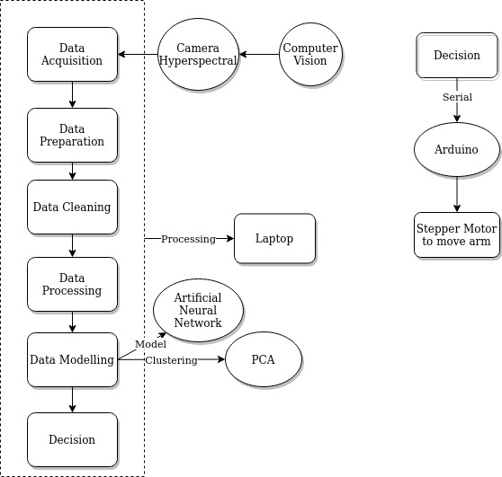
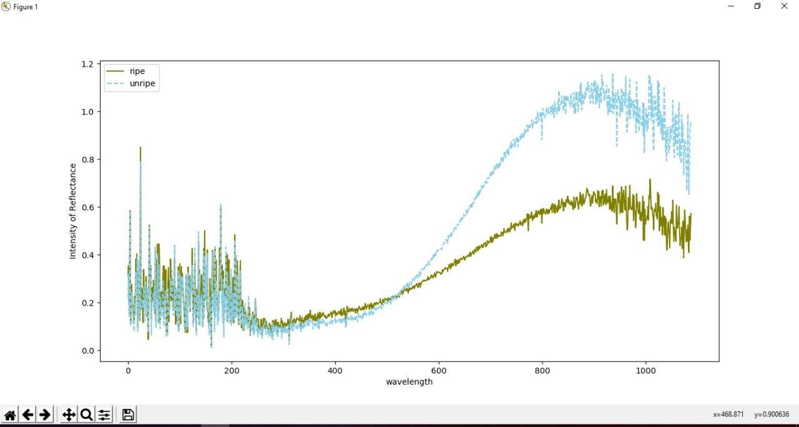

# Hyperspectral Imaging
this system is autonomous system that can detect ripeness level of palm fruit using computer vision and 
Artificial Neural Network. beside that, also involves integrations system and embedded system

# Main Requirements
1. Python3+ 
2. Currently working in OS windows
3. SDK for hyperspectral camera
4. Arduino as micro controller
5. Stepper Motor to run the arm

## other components
* A Big stepper motor to run conveyor that using chain
* A panel that control electrical system
* A other camera (RGB camera) that role as motion detection when the object is detected.
* A arm created from iron to deliver the fruit to the provided area
* A light source to brighten the area point to the fruit

# System Schema

## data processing
* the data is captured by camera. then, the image will be converted to matrix and processed using python to adjusted with model (ANN) that gonna used.
* after processed, resulted a constant that gonna used to predict the new data.
* the ouput is classification regarding ripe of unripe of palm fruit

# Graph that obtained
